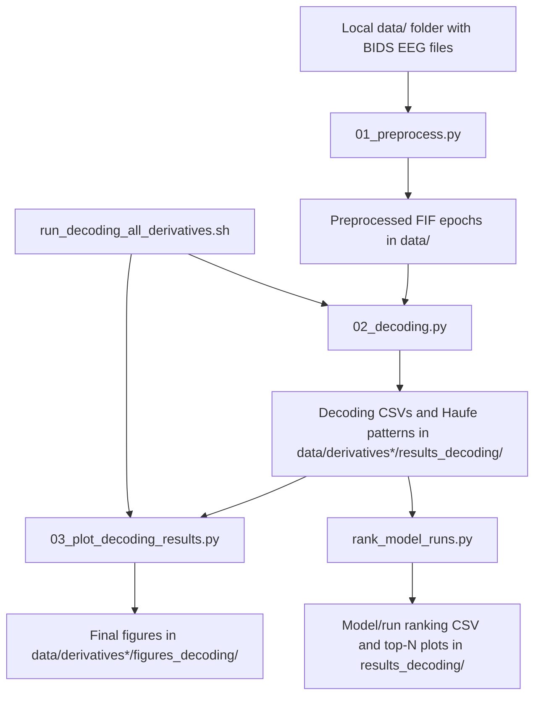

# EEG decoding project

This repository contains the full EEG pipeline for the Rock-Paper-Scissors
project:

- preprocessing of the raw BioSemi recordings,
- time-resolved decoding with multiple classifiers,
- figure generation for the final report,
- and a helper script that ranks model/run combinations.

The code is meant to be run directly from the scripts in the `code/` folder.
A shell script is included to run multiple decoding and plotting tasks in one
go.

## Important

The repository does not ship the EEG data itself.
For the pipeline to work, you must place the BIDS input files in a local data/
folder at the project root.

## Getting the data

The easiest way to match the expected structure is to clone the OpenNeuro
dataset directly into the project root as `data/`. This keeps the BIDS layout
identical to what the scripts expect while letting DataLad fetch files on
demand.

Example:

```bash
# from the repository root
datalad clone https://github.com/OpenNeuroDatasets/ds006761 data
cd data
datalad get -r .
```

If you already have the dataset elsewhere, you can also copy or symlink it into
data/ as long as the BIDS structure remains the same.

## Requirements

- Python 3.11+
- [uv](https://github.com/astral-sh/uv) recommended, or pip
- Local EEG dataset in the expected BIDS layout inside `data/`
- OpenNeuro dataset ds006761 installed into `data/` or provided with the same
  BIDS structure

## Main scripts

- `code/01_preprocess.py` — preprocessing of the raw BDF recordings
- `code/02_decoding.py` — decoding analysis for all configured targets
- `code/03_plot_decoding_results.py` — decoding figures and Haufe plots
- `code/additional_analysis/rank_model_runs.py` — ranking of model/run setups

## Script arguments

The preprocessing, decoding, and plotting scripts are intended to be run
directly. Their behavior is controlled through the YAML configuration files in
`code/`, so they do not currently take extra command-line arguments.

The ranking helper does expose a small CLI for convenience:

- `--data-root` — root directory containing the `derivatives*` folders
- `--out` — output CSV path for the ranking table
- `--chance-level` — chance level in percent
- `--trim-proportion` — fraction trimmed from each tail across subjects
- `--exclude-targets` — targets to ignore when ranking
- `--top-n` — number of top rows to plot, or `all`
- `--plot-out` — output path for the top-N bar plot
- `--no-plot` — disable plot generation

## Quick start

```bash
# Install dependencies
uv sync

# Run preprocessing directly
uv run code/01_preprocess.py

# Run decoding directly
uv run code/02_decoding.py

# Create decoding figures directly
uv run code/03_plot_decoding_results.py

# Rank all model/run combinations directly
uv run code/additional_analysis/rank_model_runs.py --top-n all
```

## Batch execution

The shell script is meant for running multiple decoding and plotting tasks in a
single pass, for example when comparing several preprocessing variants or when
recreating the final report figures.

Available arguments:

- `--figures-only` — regenerate only the figures for all derivative folders
  without re-running decoding
- `--override` — force a full re-run and overwrite existing `results_decoding`
  and figure outputs
- `-h`, `--help` — show the built-in usage help

```bash
bash run_decoding_all_derivatives.sh
bash run_decoding_all_derivatives.sh --figures-only
bash run_decoding_all_derivatives.sh --override
```

## Preprocessing

The preprocessing pipeline loads raw BioSemi BDF recordings, applies the
configured filtering and artifact-rejection steps, interpolates bad channels,
epochs the data, resamples it, and writes FIF files plus quality-control
figures.

Key points:

- the configuration lives in `code/config_preprocessing.yaml`,
- channel mapping and filtering are configuration-driven,
- ICA is optional and controlled by the config,
- the config path is relative, so the script can be run from the repository
  root.

Output example:

- `data/sub-01/sub-01_task-RPS_desc-preproc_eeg.fif`
- `data/report/sub-01_qc.png`

## Decoding

The decoding pipeline uses the preprocessed epochs and evaluates the enabled
classifiers with repeated stratified cross-validation and super-trial
averaging.

Current models:

- `lda`
- `svm`
- `logreg`
- `ridge`
- `mlp`

The model set and their hyperparameters are defined in
`code/config_decoding.yaml`.

The decoding script writes one CSV per subject with both accuracy results and,
for linear models, Haufe-pattern exports.

## Plotting

`code/03_plot_decoding_results.py` creates the final figures from the decoding
outputs:

- grand-average model comparison,
- per-model time-resolved decoding figures,
- winner-vs-loser figures,
- and Haufe topographies for models that provide them.

The plotting script reads the same configuration file as the decoding script so
that the figures stay aligned with the chosen analysis settings.

## Ranking analysis

`code/additional_analysis/rank_model_runs.py` summarizes the decoding results
across preprocessing variants and ranks the model/run combinations by a robust
area-over-chance score.

It can rank a limited number of top entries or all available combinations.

## Output folders

Typical outputs are stored under:

- `data/derivatives*` — preprocessing variants and intermediate outputs
- `data/derivatives*/results_decoding/` — decoding CSV files and Haufe pattern outputs (per derivative run)
- `data/derivatives*/figures_decoding/` — plotting outputs generated for each derivative run
- `results_decoding/` — aggregated cross-run ranking outputs (e.g., model comparison tables/plots)

## Debugging & Validation

The `debug/` folder contains a comprehensive validation framework for verifying the MATLAB-to-Python pipeline port. Since this is a complex translation of signal processing and machine learning code across two fundamentally different environments, the intermediate results **are not trivially reproducible** and require manual inspection.

### Overview

The debugging process is structured into two phases:

- **Preprocessing Validation** (Steps 1–3): MATLAB (FieldTrip) → Python (MNE/Scipy)
  - Data loading and epoching
  - Resampling (2048 Hz → 256 Hz)  
  - Channel interpolation

- **Decoding Validation** (Steps 4–5): MATLAB (CoSMoMVPA) → Python (Scikit-Learn)
  - Feature engineering (time-binning into epochs)
  - LDA classifier identity verification

### Key Reports

- **`PREPROCESSING_DEBUG_REPORT.md`** — Detailed numerical validation of the preprocessing pipeline, including step-by-step comparisons, error tolerance thresholds, and discovered implementation differences between FieldTrip and MNE.

- **`DECODING_DEBUG_REPORT.md`** — Step-by-step validation of the feature-extraction and decoding phases, including a three-phase strategy (deterministic feature engineering, stochastic decoding, and exact classifier matching).

### Debug Scripts

Each step is accompanied by a dedicated validation script:

- `debug_step1.py` — Compares raw data loading and epoching (all channels)
- `debug_step2.py` — Validates FFT-based resampling against MATLAB output
- `debug_step3_interp.py` — Tests channel interpolation with standard 10-20 label mapping
- `debug_step3_eigeneInterp.py` — Validates interpolation using exact FieldTrip neighbor sets
- `debug_step4_features.py` — Verifies time-binning and feature extraction
- `debug_step5_decoding.py` — Tests LDA decoding with CoSMoMVPA-style trial averaging
- `debug_step5_decoding_exactMatch.py` — Confirms classifier equivalence by feeding MATLAB super-trials into Python LDA

### Important: Manual Validation Required

**The validation process is not automatically reproducible** because:

1. **Intermediate MATLAB Results** — Each debug script expects `.mat` files containing intermediate results exported directly from the original MATLAB preprocessing and decoding code (stored in `originalCode/`). These files are **not generated automatically** and must be manually produced by running the corresponding MATLAB scripts and exporting the data.

2. **Ground-Truth Comparison** — To validate a new EEG preprocessing variant or decoding configuration, you must:
   - Run the MATLAB pipeline on the same raw data
   - Export intermediate matrices after each step (epoched data, resampled data, interpolated data, features, and decoding results)
   - Place the exported `.mat` files in the `originalCode/` directory
   - Run the corresponding Python debug script
   - Compare the outputs visually and numerically using the generated plots and console summaries

3. **Signal Processing Differences** — Even with identical inputs, some operations naturally produce different results due to algorithmic differences:
   - **Resampling:** MNE uses FFT-based resampling; FieldTrip uses polyphase filtering
   - **Interpolation:** MNE uses spherical spline interpolation; FieldTrip uses weighted neighbor averaging
   - **Classifier Details:** Small differences in LDA implementation details (e.g., shrinkage estimators) can produce slightly different cross-validation results

See the individual debug reports for detailed error tolerance thresholds and interpretation guidance.

### Folder Structure
```text
debug/
├── PREPROCESSING_DEBUG_REPORT.md          # Full preprocessing validation report
├── DECODING_DEBUG_REPORT.md               # Full decoding validation report
├── debug_step1.py                         # Data loading & epoching
├── debug_step2.py                         # Resampling validation
├── debug_step3_interp.py                  # Channel interpolation (10-20 mapped)
├── debug_step3_eigeneInterp.py            # Interpolation (exact neighbors)
├── debug_step4_features.py                # Feature extraction & binning
├── debug_step5_decoding.py                # LDA decoding with averaging
├── debug_step5_decoding_exactMatch.py     # Classifier identity test
```


## Troubleshooting

- If the scripts cannot find the input data, make sure the local `data/`
  folder exists and contains the BIDS files.
- If decoding is slow, reduce the number of repeats or disable expensive
  models in `code/config_decoding.yaml`.
- If preprocessing fails, verify that the raw file names and subject folders
  match the expected BIDS structure.

## Further reading

- MNE-Python: https://mne.tools/stable/index.html
- Configuration files: `code/config_preprocessing.yaml` and
  `code/config_decoding.yaml`

## Pipeline overview



