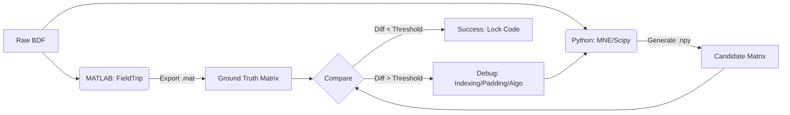

# EEG Pipeline Validation Report: MATLAB (FieldTrip) to Python (MNE/Scipy)

**Subject:** Step-by-Step Numerical Validation of Preprocessing Pipeline

## 1. Objective & Strategy
The goal is to port an existing EEG preprocessing pipeline from MATLAB (FieldTrip) to Python (MNE/Scipy) while maintaining **numerical identity**. 

Since minor implementation details (e.g., filter padding, floating-point precision, indexing) can compound into significant differences, we treat the MATLAB output as the "Ground Truth".

**The Validation Strategy:**
1.  **Atomic Isolation:** The pipeline is broken down into atomic steps (Loading -> Epoching -> Resampling -> Interpolation).
2.  **Golden Copy Extraction:** Intermediate data matrices are exported from MATLAB (`.mat` v7 format) after every significant operation.
3.  **Stepwise Reconstruction:** Python code is adjusted iteratively until the output matches the Golden Copy within acceptable tolerance (< 1e-13 for raw data, < 0.1 µV for signal processing).

### Validation Workflow

## 2. Summary of Results
| Step | Operation     | Method Tested           | Status  | Max Error    | Conclusion                 |
| ---- | ------------- | ----------------------- | ------- | ------------ | -------------------------- |
| 01   | IO & Epoching | `read_raw_bdf`+ slicing | done    | `3.6e-12`    | perfect numerical identity |
| 02   | resampling    | `resample_poly`         | done    | `8.1e-02` µV | "idential"                 |
| 03   | interpolation | splines vs. Distance    | pending |              |                            |

## 3. Detailed Analysis
### Step 1: Data Loading & Epoching
*see [debug_step1.py](debug_step1.py)*  
**Goal:** Ensure Python reads the raw `.bdf` files and extracts the exact same time windows (samples) as FieldTrip.
- **Subject Tested**: sub-01, Pair 1, Player 1.
- **Challenge**: MATLAB uses 1-based indexing (inclusive), Python uses 0-based indexing (exclusive).
- **Resolution**:
  - MATLAB TRL matrix export used to define start/end samples.
  - Python Indexing: `start = matlab_start - 1`, `end = matlab_end`.
  - Unit Correction: MATLAB output was in µV (via `ft_read_header` config), MNE loaded in V. Applied `1e6` scaling factor.

**Result**
 *Fig 1* 
The signals were effectively identical. The residual noise (`1e-13`) is attributed to floating-point precision differences between the engines.
*Fig 1: Butterfly plot of residuals (Difference between MATLAB and Python) for all 64 channels. The flat line indicates zero difference.*

## 4. Downsampling (2048 -> 256Hz)
*see [debug_step2.py](debug_step2.py) & [debug_step2_angepasstesResampling.py](debug_step2_angepasstesResampling.py)*  
 *Fig 2* 
 *Fig 3* 
 *Fig 4* 

**Goal**: replicate the anti-aliasing filter and decimation process.
- **Subject Tested**: `sub-01` (No interpolation involved to isolate resampling).
- **Initial Failure (FFT Method):**
  - MNE's default `epochs.resample()` uses FFT-based resampling.
  - MATLAB's `resample()` (Signal Processing Toolbox) uses a Polyphase FIR filter.
  - Result: Huge edge artifacts and ringing. MAE ~2.2 µV. 
  - (see Fig 2)
- **Correction (Polyphase Method):** 
  - Switched to `scipy.signal.resample_poly`
  - Reduced MAE to ~0.03 µV, but Max Error remained high (~42 µV) at the boundaries.
  - (see Fig 3)
- **Padding Optimization**:
  - Filter artifacts at the edges depend on how the signal is padded. We ran a "Brute Force" test against MATLAB's output.

### Padding Test Results:
| Padding Type  | Mean Abs Error (µV) | Max Error (µV) | Verdict        |
| ------------- | ------------------- | -------------- | -------------- |
| `constant`(0) | 2.62                | 9986.9         | fail           |
| `line`        | 0.036               | 42.2           | edge artifacts |
| `reflect `    | 0.033               | 39.4           | edge artifacts |
| `mean`        | **0.013**           | **0.081**      | **Winner**     |

### Conclusion
MATLAB's `resample` implementation (in this version) handles boundaries most similarly to Scipy's `padtype='mean'`. The final error of **0.08 µV** is magnitudes below the EEG noise floor.
*see Fig 4: Comparison of the "Worst Channel" after Polyphase resampling with 'mean' padding. Top: Overlay (Zoom). Bottom: Difference (Red).*
