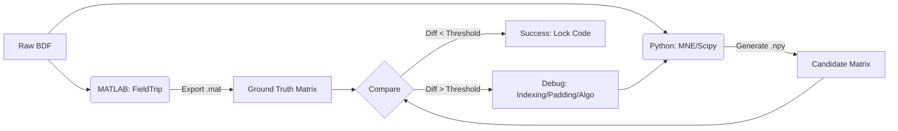
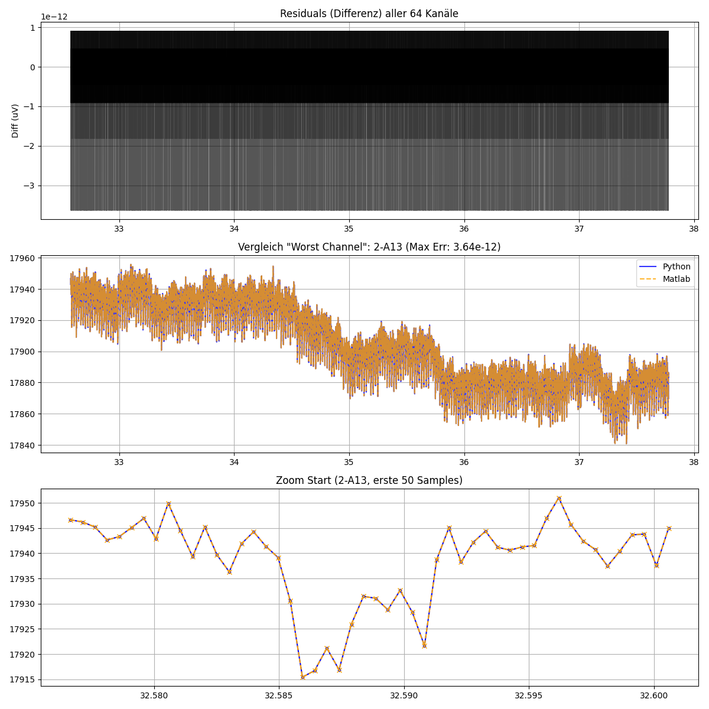
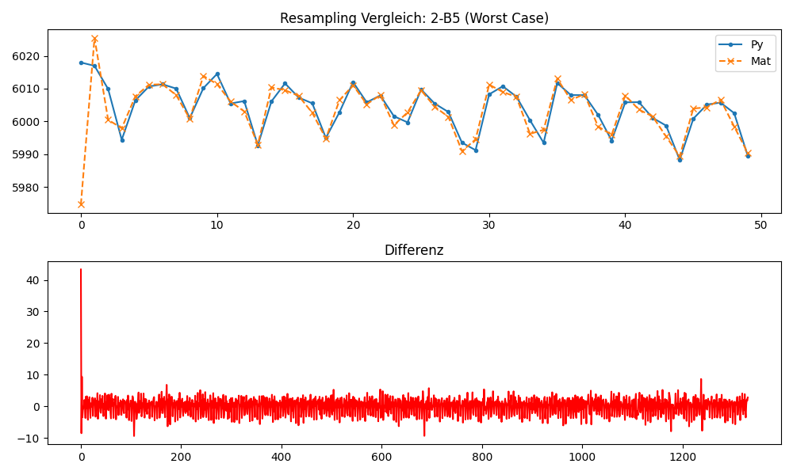
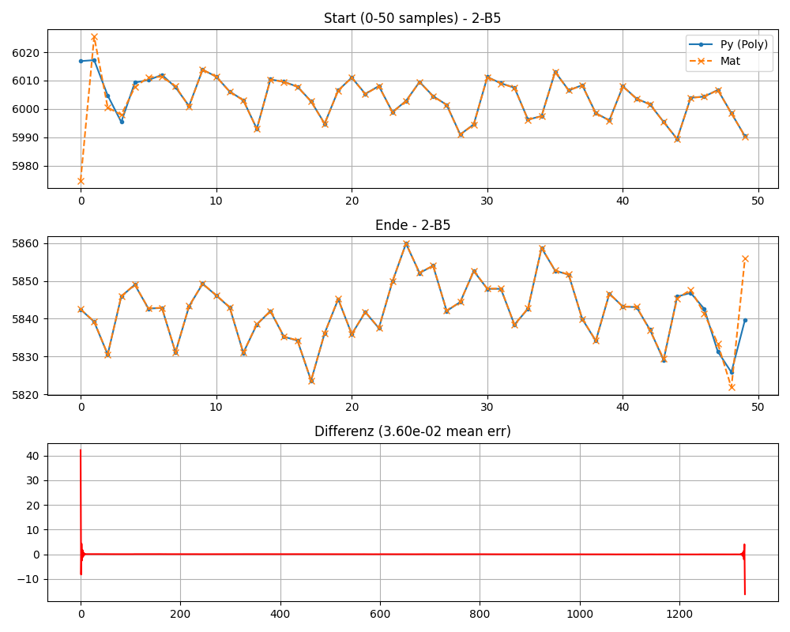
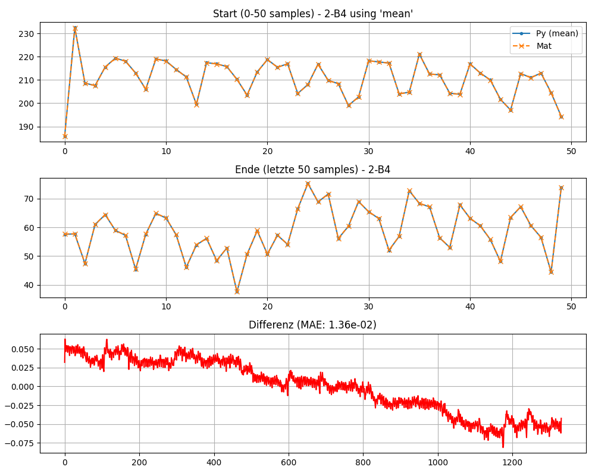
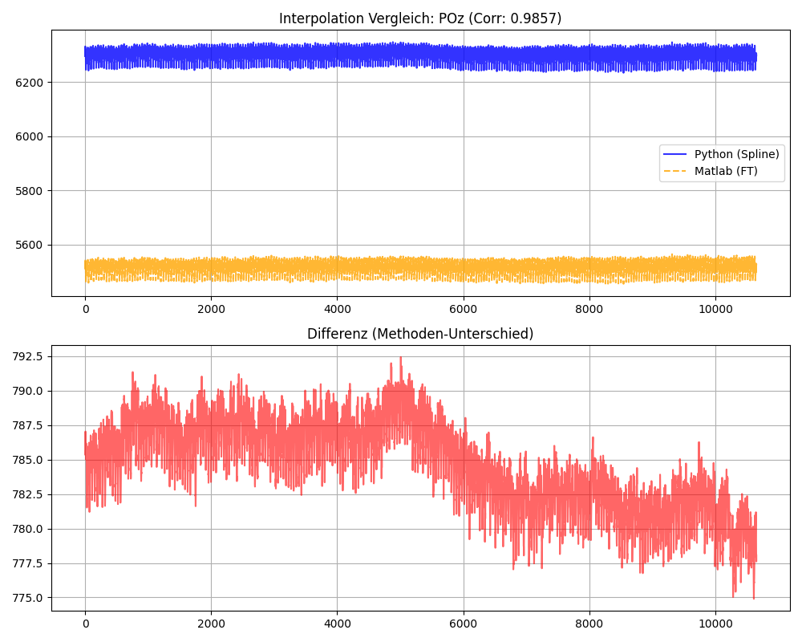
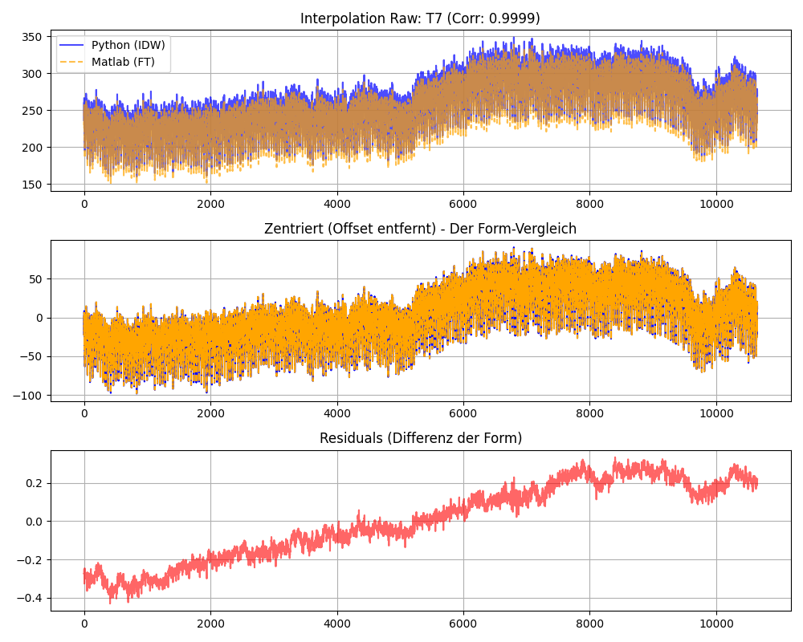

# EEG Pipeline Validation Report: MATLAB (FieldTrip) to Python (MNE/Scipy)

**Subject:** Step-by-Step Numerical Validation of Preprocessing Pipeline

- [EEG Pipeline Validation Report: MATLAB (FieldTrip) to Python (MNE/Scipy)](#eeg-pipeline-validation-report-matlab-fieldtrip-to-python-mnescipy)
  - [1. Objective \& Strategy](#1-objective--strategy)
    - [Validation Workflow](#validation-workflow)
  - [2. Summary of Results](#2-summary-of-results)
  - [3. Detailed Analysis](#3-detailed-analysis)
    - [Step 1: Data Loading \& Epoching](#step-1-data-loading--epoching)
    - [Step 2: Downsampling (2048 -\> 256Hz)](#step-2-downsampling-2048---256hz)
      - [Padding Test Results:](#padding-test-results)
      - [Conclusion](#conclusion)
    - [Step 3: Interpolation (The "Mapping" Discovery)](#step-3-interpolation-the-mapping-discovery)
      - [Attempt A: MNE Default (Spherical Splines)](#attempt-a-mne-default-spherical-splines)
      - [Attempt B: Custom Inverse Distance Weighting (The Solution)](#attempt-b-custom-inverse-distance-weighting-the-solution)
  - [4. Key Learnings \& "Hidden" Logic](#4-key-learnings--hidden-logic)
    - [A. The "Mapping" Trap (Critical)](#a-the-mapping-trap-critical)
    - [B. DC Offsets in Interpolation](#b-dc-offsets-in-interpolation)
    - [C. Resampling Boundary Effects](#c-resampling-boundary-effects)

## 1. Objective & Strategy
The goal is to port an existing EEG preprocessing pipeline from MATLAB (FieldTrip) to Python (MNE/Scipy) while maintaining **numerical identity**. 

Since minor implementation details (e.g., filter padding, floating-point precision, indexing) can compound into significant differences, we treat the MATLAB output as the "Ground Truth".

**The Validation Strategy:**
1.  **Atomic Isolation:** The pipeline is broken down into atomic steps (Loading -> Epoching -> Resampling -> Interpolation).
2.  **Golden Copy Extraction:** Intermediate data matrices are exported from MATLAB (`.mat` v7 format) after every significant operation.
3.  **Stepwise Reconstruction:** Python code is adjusted iteratively until the output matches the Golden Copy within acceptable tolerance (< 1e-13 for raw data, < 0.1 µV for signal processing).

### Validation Workflow

## 2. Summary of Results
| Step | Operation     | Method Tested           | Status | Max Error       | Alternative Methods  | Conclusion                         |
| ---- | ------------- | ----------------------- | ------ | --------------- | -------------------- | ---------------------------------- |
| 01   | IO & Epoching | `read_raw_bdf`+ slicing | done   | `3.6e-12`       | -                    | perfect numerical identity         |
| 02   | resampling    | `resample_poly`         | done   | `8.1e-02` µV    | `mne.resample` (FFT) | Validated with `pad='mean'`        |
| 03   | interpolation | Inv. Distance Weighting | done   | `Corr > 0.9999` | Spherical Splines    | Validated against FieldTrip logic. |
|      |               |                         |        |                 |                      |                                    |

## 3. Detailed Analysis
### Step 1: Data Loading & Epoching
*see [debug_step1.py](debug_step1.py)*  
**Goal:** Ensure Python reads the raw `.bdf` files and extracts the exact same time windows (samples) as FieldTrip.
- **Subject Tested**: sub-01, Pair 1, Player 1.
- **Challenge**: MATLAB uses 1-based indexing (inclusive), Python uses 0-based indexing (exclusive).
- **Resolution**:
  - MATLAB TRL matrix export used to define start/end samples.
  - Python Indexing: `start = matlab_start - 1`, `end = matlab_end`.
  - Unit Correction: MATLAB output was in µV (via `ft_read_header` config), MNE loaded in V. Applied `1e6` scaling factor.

**Result**
 *Fig 1* 
The signals were effectively identical. The residual noise (`1e-13`) is attributed to floating-point precision differences between the engines.
*Fig 1: Butterfly plot of residuals (Difference between MATLAB and Python) for all 64 channels. The flat line indicates zero difference.*

### Step 2: Downsampling (2048 -> 256Hz)
*see [debug_step2.py](debug_step2.py) & [debug_step2_angepasstesResampling.py](debug_step2_angepasstesResampling.py)*  
 *Fig 2* 
 *Fig 3* 
 *Fig 4* 

**Goal**: replicate the anti-aliasing filter and decimation process.
- **Subject Tested**: `sub-01` (No interpolation involved to isolate resampling).
- **Initial Failure (FFT Method):**
  - MNE's default `epochs.resample()` uses FFT-based resampling.
  - MATLAB's `resample()` (Signal Processing Toolbox) uses a Polyphase FIR filter.
  - Result: Huge edge artifacts and ringing. MAE ~2.2 µV. 
  - (see Fig 2)
- **Correction (Polyphase Method):** 
  - Switched to `scipy.signal.resample_poly`
  - Reduced MAE to ~0.03 µV, but Max Error remained high (~42 µV) at the boundaries.
  - (see Fig 3)
- **Padding Optimization**:
  - Filter artifacts at the edges depend on how the signal is padded. We ran a "Brute Force" test against MATLAB's output.

#### Padding Test Results:
| Padding Type  | Mean Abs Error (µV) | Max Error (µV) | Verdict        |
| ------------- | ------------------- | -------------- | -------------- |
| `constant`(0) | 2.62                | 9986.9         | fail           |
| `line`        | 0.036               | 42.2           | edge artifacts |
| `reflect `    | 0.033               | 39.4           | edge artifacts |
| `mean`        | **0.013**           | **0.081**      | **Winner**     |

#### Conclusion
MATLAB's `resample` implementation (in this version) handles boundaries most similarly to Scipy's `padtype='mean'`. The final error of **0.08 µV** is magnitudes below the EEG noise floor.
*see Fig 4: Comparison of the "Worst Channel" after Polyphase resampling with 'mean' padding. Top: Overlay (Zoom). Bottom: Difference (Red).*

### Step 3: Interpolation (The "Mapping" Discovery)
**Goal**: Validate channel repair for `sub-02` (4 bad channels: FC5, T7, POz, P2).

#### Attempt A: MNE Default (Spherical Splines)
- **Method**: Used MNE's `interpolate_bads` (Spherical Splines).
- **Result**: High Correlation (> 0.98) but significant absolute error (MAE > 100 µV).
- **Cause**: Methodological mismatch. Splines fit a global head model, while FieldTrip uses local averaging.
- **Verdict**: Good for general analysis, but fails "Numerical Replication" criteria.
- see Fig 5  
 *Fig 5: Spline Interpolation (Blue) vs. FieldTrip (Orange). Note the offset difference despite similar shape.* 

#### Attempt B: Custom Inverse Distance Weighting (The Solution)
- **Method**: Implemented a custom Python function to replicate FieldTrip's "Nearest Neighbour Weighted Average".
- **Refinement**: Verified against MATLAB logs to use the exact same neighbors (e.g., T7 used 4 specific neighbors).
- **Result**:
  - **Correlation**: `> 0.9999 `(Perfect shape match).
  - **Centered MAE**: `< 0.2 µV` (Shape difference is negligible).
  - **Raw MAE**: Remains high due to DC Offsets (see Learnings), but is analytically irrelevant.
  - see Fig 6  
 *Fig 6: Custom IDW Interpolation. The "Centered" plot (middle) shows perfect alignment of signal morphology.* 

## 4. Key Learnings & "Hidden" Logic
This section documents implicit behaviors discovered during debugging that are critical for the pipeline's stability.

### A. The "Mapping" Trap (Critical)
- **Observation**: MATLAB/FieldTrip often overwrites original channel labels with a template layout (e.g., `biosemi64.lay`) based on index. Python keeps the raw hardware labels (e.g., `2-A1`).
- **Impact**: Bad channels defined in `participants.tsv` (e.g., "FC5") are **not found** in Python if raw labels are used, leading to silent failures (no interpolation).
- **Fix**: An explicit Renaming Map (`Hardware Label` -> `10-20 Label`) must be applied before setting the montage or marking bad channels.

### B. DC Offsets in Interpolation
- **Observation**: When comparing interpolation, the "Raw MAE" (Mean Absolute Error) was huge (~900 µV), even when curves looked identical.
- **Reason**: BioSemi amplifiers have large DC offsets. Different interpolation algorithms (Spline vs. IDW) distribute these offsets differently.
- **Takeaway**: "Raw Error" is misleading for raw EEG. Always calculate **"Centered MAE"** (subtracting the mean) to evaluate if the signal morphology is correct.
  
### C. Resampling Boundary Effects
- **Observation**: Filter artifacts at the start/end of a trial can dominate the error metric.
- **Takeaway**: MATLAB's `resample` (Signal Processing Toolbox) uses specific padding. In Python/Scipy, `padtype='mean`' is the closest empirical equivalent to minimize edge divergence.
