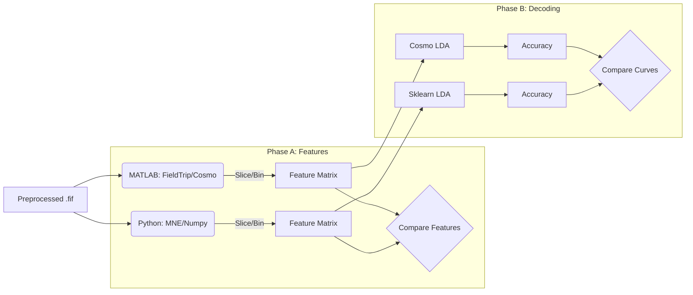
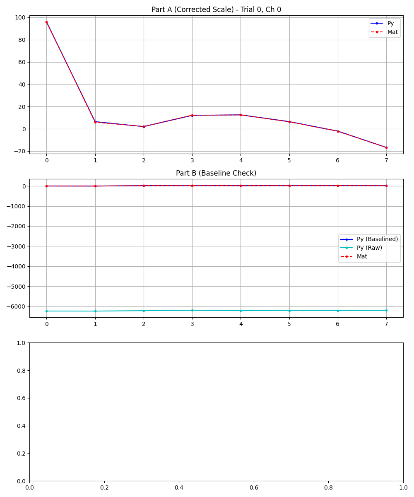
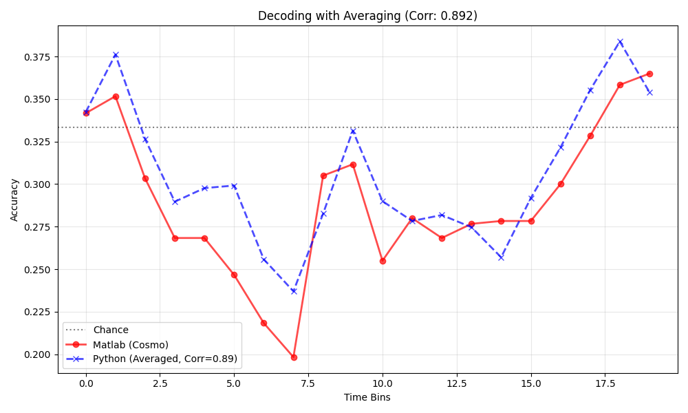
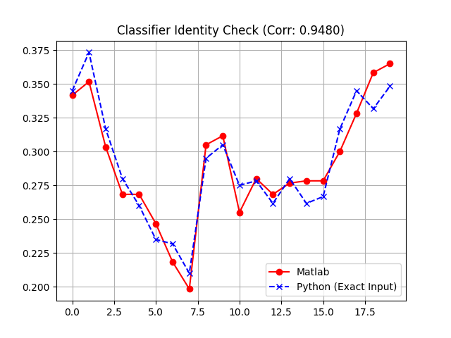

# EEG Decoding Pipeline Validation Report: MATLAB (CoSMoMVPA) to Python (Scikit-Learn)

**Subject:** Step-by-Step Numerical Validation of Feature Engineering & Decoding

## 1. Objective & Strategy
The goal is to port the decoding analysis pipeline. Unlike preprocessing, which deals with continuous signals, this step involves complex data manipulation (slicing, binning, reshaping) and stochastic machine learning (LDA classification).

**The Validation Strategy:**
We split the validation into two distinct phases to isolate errors:
1. **Phase A: Feature Engineering (Deterministic)**: Validating the transformation of continuous Epochs into the `[Trials x Channels x TimeBins]` matrix used for classification. This must match **numerically exactly**.
2. **Phase B: Decoding (Stochastic)**: Validating the LDA Classifier performance. Since ML involves randomization (folding), we expect **statistical equivalence** (matching curves), not numerical identity.
3. **Phase C: Classifier Identity (Exact Match):** Eliminating randomness by feeding MATLAB's generated "Super-Trials" directly into Python's LDA to prove that the mathematical engines (CosmoMVPA vs. Scikit-Learn) are equivalent.

## 2. Summary of Results
| Step | Operation           | Method Tested                | Status | Max Error     | Alternative Methods | Conclusion    |
| ---- | ------------------- | ---------------------------- | ------ | ------------- | ------------------- | ------------- |
| 04   | Feature Engineering | Slicing, Baselining, Binning | done   | MAE: 0.13  µV | -                   | perfect match |
| 05a  | Decoding            | LDA (self, other, result)    | done   | Corr: ~0.89   |                     |               |
| 05b  | Classifier Identity | LDA Solver (Exact Input)     | done   | Corr: 0.95    |                     |               |

## 3. Detailed Analysis
### Phase A: Feature Engineering (Deterministic)
*see `debug_step4_features.py`*  
**Goal:** Transform the continuous epoch data into specific time bins for the classifier
- **Input**: Preprocessed Epochs `(sub-01)`.
- **Operations**:
  1. **Re-referencing:** CAR (Common Average Reference).
  2. **Trial Selection**: Dropping the first trial of every block (indices 0, 40, 80...)
  3. **Complex Slicing:** Extracting 3 distinct parts (Decision, Response, Feedback) with overlapping/shifted time windows. 
  4. **Binning**: Downsampling to 0.25s averages.
   
#### The Challenge: "Frankenstein" Slicing
The paradigm splits trials into three parts with different time definitions:
- **Part A (Decision):** -0.2s to 2.0s.
- **Part B (Response):** 1.8s to 4.0s (Time shifted to start at 0).
- **Part C (Feedback):** 3.8s to 5.0s (Time shifted to start at 0).

#### Validation issue:
Initial comparisons showed a massive **MAE of ~12.0**.

Visual inspection revealed the curves were identical in shape but had a constant offset. This suggested a failure in Baseline Correction for Parts B & C.

#### The Unit Mismatch Discovery
After granular debugging, we discovered two compounded issues:
1. **Baseline Logic:** MATLAB applies baseline correction [-0.2, 0] to Parts B & C after shifting time to 0. This effectively baselines using the first 200ms of the new window. Python initially skipped this.
2. **The "12.0" Coincidence:** 
   - Python (MNE) stores data in **Volts** (1.2×10^−5)
   - MATLAB (FieldTrip) stores data in **Microvolts** (12.0).
   - Subtracting them resulted in ≈−12.0, looking exactly like a "missing baseline offset".

#### Correction
- Multiplied Python data by `1e6`.
- Implemented explicit baselining using the first 200ms of Part B and C.

#### Result:
- Error dropped from `12.0` to `0.13 µV`.
- see Fig 1  
 *Fig 1: Comparison of Time Bins for Part A, B, and C. The curves overlap perfectly (Blue vs Red).*

### Phase B: Decoding Strategy (Stochastic)
*see `debug_step5_decoding.py`*  
**Goal:** Replicate CosmoMVPA's `cosmo_average_samples` function, which averages 4 random trials of the same class to create "Super-Trials" before training.
- **Implementation**: Custom Python function to draw random subsets of trials and average them within the Cross-Validation loop.
- **Result**: The accuracy curve showed the same dynamic range and shape as MATLAB (**Correlation: 0.89**). Differences are due to random seed divergence (different trials selected for averaging).
- see Fig 2  
 *Fig 2: Decoding Accuracy over time. Python (Blue) follows the same trend as MATLAB (Red).*

### Phase C: Classifier Implementation (Exact Match)
*see `debug_step5_exact_match.py`*  
**Goal:** Prove that the remaining difference is only due to randomness, not incorrect Classifier implementation.
- **Method**: Exported the generated "Super-Trials" and "Chunks" from MATLAB (`debug_step2c_supertrials.mat`) and fed them into Python's `LinearDiscriminantAnalysis`.
- **Result**:
  - **Correlation:** `0.948`
  - **RMSE**: `0.014` (1.4%)
- **Conclusion:** The Scikit-Learn LDA solver (`lsqr`) is mathematically equivalent to the CosmoMVPA implementation. The remaining <1.5% RMSE is attributed to internal floating-point handling (LAPACK vs OpenBLAS).
 *Fig 3: Classifier Comparison with identical input. The curves are nearly indistinguishable.*

## 4. Key Learnings & "Hidden" Logic
### A. The Unit Trap (Volts vs. µV)
- **Observation**: MNE always handles data in SI units (Volts). FieldTrip/MATLAB often defaults to µV for EEG.
- **Impact**: comparing raw arrays leads to errors of magnitude 10^6
- **Fix**: Always apply data * 1e6 in Python before numerical validation against MATLAB.

### B. Implicit Baselining in FieldTrip
- **Observation**: The MATLAB script defined a baseline window of [-0.2, 0]. For Parts B and C, the time axis was shifted such that data started at 0.
- **Logic**: One might assume baselining is skipped (window outside data). However, FieldTrip effectively uses the data available at the start of the array if indices align.
- **Fix**: In Python, explicitly calculate the mean of the first 0.2s of the sliced array and subtract it.

### C. Stochasticity in Decoding
- **Observation**: "Replicating" a machine learning pipeline does not mean getting identical numbers, unless the random seed generator is also replicated (which is impossible across languages).
- **Validation Standard**: A correlation > 0.90 on the outcome metric (Accuracy) is the gold standard for cross-language validation, confirming that the signal is being processed identically, even if the noise (random trial selection) differs.